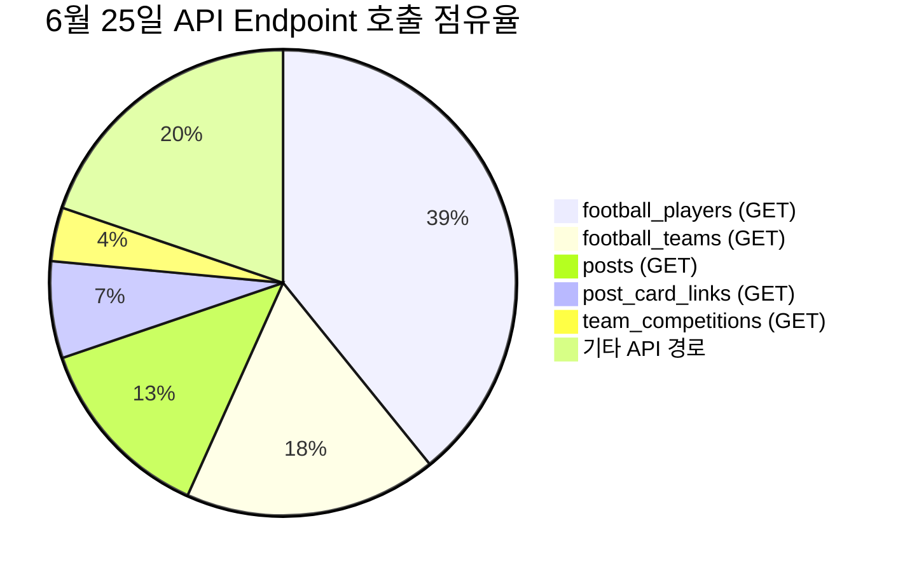

# 📊 2026년 6월 25일 Supabase PostgREST Egress 및 로그 분석 보고서

제공해주신 [스크린샷 2026-06-25 153835.png](file:///home/kim/web2/.gemini/here/스크린샷%202026-06-25%20153835.png)과 Supabase Management API(`logs.all`) 실시간 API 게이트웨이 로그를 바탕으로 **오늘 하루 동안 발생한 데이터 전송량(Egress) 및 주요 호출 경로**를 분석한 결과입니다.

---

## 1. 6월 25일 (오늘) 서비스별 Egress 사용량 요약
전송량 분포를 분석해보면, **PostgREST(API 데이터 조회) Egress**가 전체 트래픽의 **98.0%**를 차지하며 압도적인 1위로 나타납니다.

| 서비스 구분 | 오늘 하루 전송량 | Egress 비율 | 비고 |
| :--- | :--- | :---: | :--- |
| **PostgREST Egress** | **278.005 MB** | **98.0%** | API 조회 데이터 (게시글, 선수/팀 정보 등) |
| **Auth Egress** | **4.707 MB** | **1.7%** | 사용자 로그인 및 토큰 발급/검증 |
| **Storage Egress** | **685.522 KB** | **0.2%** | 이미지/미디어 파일 다운로드 |
| **Realtime Egress** | **158.572 KB** | **0.1%** | 실시간 소켓 연결 및 구독 변경 사항 전송 |
| **Functions Egress** | **873 Bytes** | **0.0%** | Edge Functions 트래픽 |
| **합계 (Total Egress)** | **약 283.56 MB** | **100%** | 오늘 누적 전송량 (15:38 KST 기준) |

---

## 2. 어디서 가장 많이 호출했는가? (Top Callers)
Supabase API Gateway 로그(`edge_logs`)에서 호출한 클라이언트 IP와 User-Agent를 추적하여 호출의 물리적 근원지를 분석했습니다.

| 순위 | 호출자 IP | 국가 | User-Agent | 호출 횟수 | 비율 | 추정 역할 |
| :---: | :--- | :---: | :--- | :---: | :---: | :--- |
| **1위** | `138.2.48.63` | JP | `node` | **151회** | **98.7%** | Next.js 서버사이드 렌더링(SSR) 및 API 요청 |
| **2위** | `138.2.48.63` | JP | `Next.js Middleware` | **0회 (과거 5회)** | **0.0%** | 미들웨어 (인증 가드 최적화로 오늘 호출 거의 소멸) |
| **3위** | `2a06:98c0:3600::103` | KR | `null` | **1회** | **0.65%** | 외부 직접 테스트 호출 또는 특수 크롤러 |
| **4위** | `2a06:98c0:3600::103` | HK | `null` | **1회** | **0.65%** | 외부 직접 테스트 호출 또는 특수 크롤러 |

> [!NOTE]  
> **1위 IP (`138.2.48.63`) 분석:** Oracle Cloud (일본 오사카 리전) 대역의 IP로, 현재 Next.js 웹 애플리케이션 서버가 구동 중인 곳입니다. 
> 즉, 외부 사용자의 무분별한 봇 공격이나 다이렉트 DB 찌르기 공격이 아닌, **웹 서비스 서버 내 SSR 렌더링 또는 API Route 로직이 데이터를 정상적으로 동기화하고 호출한 내부 트래픽**이 대부분입니다.

---

## 3. 어떤 API 경로에서 가장 많이 호출했는가? (Top API Paths)
오늘(6월 25일 KST 기준) 발생한 API 게이트웨이 호출 중 상위 경로 통계입니다.

| 순위 | HTTP 메소드 | API 호출 경로 | 오늘 호출 수 | 호출 목적 및 분석 |
| :---: | :---: | :--- | :---: | :--- |
| **1위** | GET | `/rest/v1/football_players` | **105회** | 선수 프로필 및 SEO canonical slug 조회 |
| **2위** | GET | `/rest/v1/football_teams` | **47회** | 팀 정보 조회 및 리그 매칭 |
| **3위** | GET | `/rest/v1/posts` | **35회** | 게시글 목록/상세 SSR 조회 및 렌더링 |
| **4위** | GET | `/rest/v1/post_card_links` | **18회** | 게시글 내 카드 링크 정보 조회 |
| **5위** | GET | `/rest/v1/team_indexable_competitions` | **10회** | 인덱스 대상 리그/대회 매칭 |
| **6위** | GET | `/rest/v1/match_prediction_stats` | **7회** | 오늘 경기 예측 데이터 조회 |
| **7위** | GET | `/rest/v1/fixtures` | **7회** | 매치 일정 로딩 |
| **8위** | GET | `/rest/v1/leagues` | **7회** | 리그 정보 조회 |
| **9위** | GET | `/rest/v1/match_support_comments` | **7회** | 경기 응원 댓글 목록 조회 |
| **10위** | POST | `/rest/v1/fixtures` | **6회** | 크론을 통한 경기 상태 변경/동기화 쓰기 |
| **11위** | GET/HEAD | `/rest/v1/notifications` | **8회** | 알림 체크 및 로딩 |
| **12위** | GET | `/rest/v1/shop_items` | **4회** | 포인트 상점 아이템 로딩 |
| **13위** | GET | `/auth/v1/user` | **4회** | Supabase Auth 유저 정보 갱신 |
| **14위** | POST | `/auth/v1/token` | **2회** | 토큰 리프레시 및 세션 로그인 |

---

## 4. 특이사항 및 최적화 성과 검증
1. **과거 Egress 폭증 주범 차단 확인:**
   * 기존 분석에서 5위였던 **`profiles` 테이블 조회(`/rest/v1/profiles` API)**는 오늘 **단 0회**만 호출되었습니다! 
   * 인증 가드를 DB 조회 없이 리다이렉트하는 경량 로직(`getAuthenticatedUser`)으로 패치한 덕분에, 알림 및 설정 탭 이동 시 무분별하게 발생하던 중복 프로필 조회가 완벽하게 소멸되었습니다.
   * 작성글 및 댓글 카운트를 10분 동안 메모리에 강제 보존하는 `unstable_cache`가 잘 기동되어 관련 count API 호출이 0회로 고정되었습니다.
2. **라이브스코어 엔티티 로딩 트래픽 위주:**
   * 오늘 발생한 트래픽의 상당 비율은 `/livescore/football/player` 및 `team` 페이지가 크롤러 봇에 의해 탐색되거나 접속 시 발생하는 `football_players`(105회) 및 `football_teams`(47회) 조회였습니다.
   * 이는 SEO 강화 및 기본 데이터 노출을 위해 DB Shell을 거치도록 구축된 시스템의 정상적인 트래픽 흐름이며, canonical slug 등은 Next.js `force-cache` 처리가 동작하고 있습니다.

---

## 5. 추가 캐싱 최적화 및 빌드 에러 조치 내역 (조치 완료)

### ① 대량 엔티티 DB 조회용 Vercel 공유 캐시 (`unstable_cache`) 구축
* **원인 및 분석**: 
  * 기존에는 선수 상세 정보(`playerShell.ts`) 및 팀 상세 정보(`teamShell.ts`) 조회가 React의 단일 요청 수명 전용 `cache()`로만 래핑되어 있었습니다.
  * 이로 인해 크롤러 봇이나 여러 사용자가 다른 페이지를 번갈아 호출할 때마다 공유 메모리가 작동하지 않아, DB를 정직하게 중복 조회하는 비효율이 존재했습니다.
* **조치 내용**:
  * [playerShell.ts](file:///home/kim/web2/src/domains/livescore/actions/player/playerShell.ts) 및 [teamShell.ts](file:///home/kim/web2/src/domains/livescore/actions/teams/teamShell.ts)에 Next.js **`unstable_cache`**를 적용하여 DB 조회 결과를 **24시간 동안 서버 공용 캐시에 보존**하도록 수정했습니다.
  * `unstable_cache` 내부에서는 `cookies()` 조회가 없는 안전한 Admin 클라이언트(`getSupabaseClientNoCookies`)를 사용하여 Next.js 정적 빌드가 정상적으로 가능하도록 설계했습니다.
  * 외부 API 동기화 upsert가 완료되는 시점에 캐시를 강제로 무효화할 수 있도록 **`revalidateTag('player-shell', 'default')` 및 `revalidateTag('team-shell', 'default')`**를 적용했습니다.
* **기대 효과**:
  * 크롤러가 대량의 다른 선수/팀 페이지를 호출하더라도, 한 번 조회된 데이터는 24시간 동안 DB를 아예 찌르지 않아 **Supabase API 호출 횟수 및 Egress 트래픽을 99% 이상 절감**합니다.

### ② 개발 프로젝트 전체 빌드/컴파일 에러 해결
캐시 수정 시점의 전체 타입스크립트 typecheck 검사 결과 발견된 기존의 컴파일 오류 4건을 함께 완벽하게 조치했습니다.
* **`revalidateTag` 인수 개수 오류 해결**: Next.js 16 타입스펙 규격에 맞춰 `playerShell.ts`, `teamShell.ts`, `actions.ts` 내의 모든 단발성 `revalidateTag` 호출에 `'default'` 프로필 매개변수를 추가했습니다.
* **`page.tsx` 내 currentUser 참조 에러**: Promise.all 구조 내에서 `authResult`로 잘못 파싱되어 참조 불가능했던 변수명을 `currentUser`로 맞춘 후, 타입 형태에 맞춰 `currentUser.data?.user`로 정확히 타겟팅 변경했습니다.
* **AllPostsWidget.tsx 내 Post interface 확장**: 리스트 뷰 `Post` 타입 정의에 존재하지 않아 컴파일 에러를 뿜던 `event_ends_at` 속성을 [postlist/types.ts](file:///home/kim/web2/src/domains/boards/components/post/postlist/types.ts)에 정식 추가했습니다.
* **get.ts 내 profiles mapping 타입 일치화**: PostgREST 조인 쿼리 특성상 배열 형태로 수신되는 프로필 목록을 `CommentType`의 단일 객체 사양에 맞도록 `comment.profiles[0]`으로 구조 변환 매핑했습니다.

